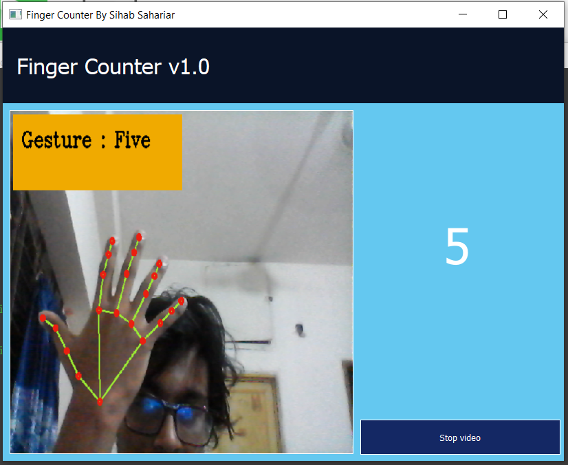

# Finger Counter GUI With Multithreading 
Mediapipe &amp; OpenCV Integration with PyQt5
```
pip install PyQt5
pip install opencv-python
pip install numpy
pip install mediapipe
```

## Ideas:
- use This Example to integrate with PyQt5 for any kind of Pose Estimation Software.

### Preview


### References 
- https://google.github.io/mediapipe/
- https://sihabsahariar.medium.com/a-multi-threading-approach-for-faster-opencv-video-streaming-in-python-7324f11dbd2f
